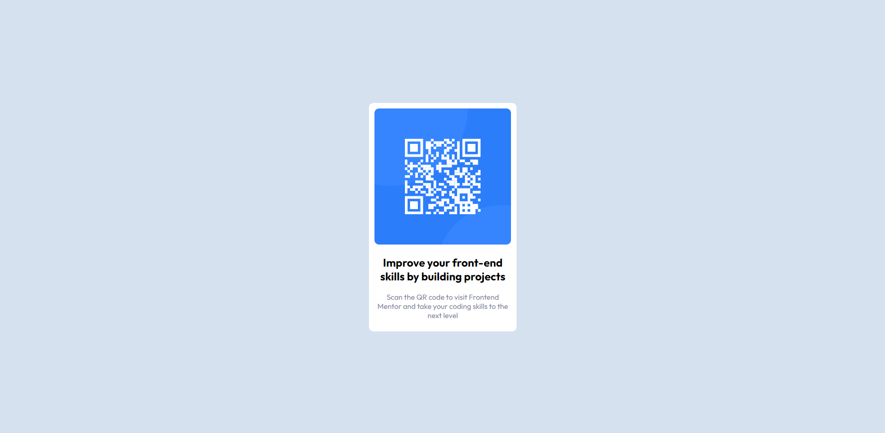

# Frontend Mentor - QR code component solution

This is a solution to the [QR code component challenge on Frontend Mentor](https://www.frontendmentor.io/challenges/qr-code-component-iux_sIO_H). Frontend Mentor challenges help you improve your coding skills by building realistic projects.

## Table of contents

- [Overview](#overview)
  - [Screenshot](#screenshot)
  - [Links](#links)
- [Author](#author)

## Overview

### Screenshot

### Links

- Solution URL: [Add solution URL here](https://github.com/SG-003/fe-mentor-qr-code-component)
- Live Site URL: [Add live site URL here](https://sg-003.github.io/fe-mentor-qr-code-component/)

## Author

- Frontend Mentor - [@SG-003](https://www.frontendmentor.io/profile/SG-003)
